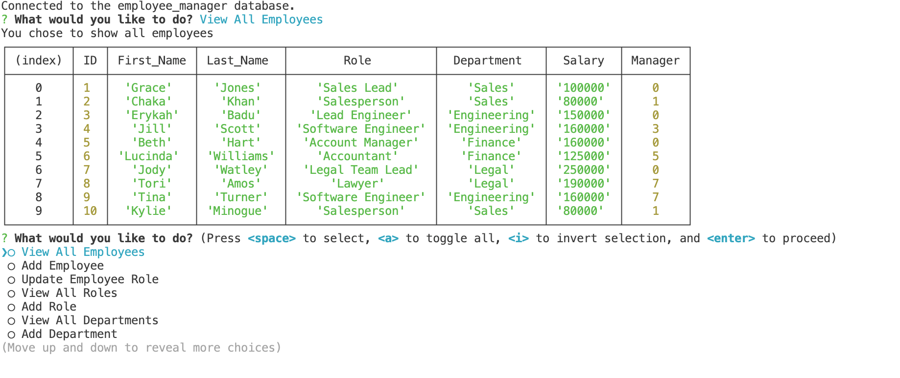

# Employee-Tracker

### This app will be used as a an employee tracker tool. This uses a node.js command line interface with express.js and mysql.
### You can view all employees, add an employee, update an employee's role, delete and employee, view all roles, add a role, delete a role, view all departments, add a department or delete a department.

### badges

## Table of Contents

- [installation](#installation)
- [contribution guidelines](#contribution)
- [Test Instructions](#testing)
- [License](#license)
- [Questions](#questions)

### Installation
You can use the following by cloning the github repository and running the program from the command line using node.js

### Contribution Guidelines
N/A as of yet
### Testing
Multiple days were spent testing to ensure proper data was being written to the JSON file and retrieved properly.
### Questions
    email address : kevinnivek@me.com
    - additional instructions 
    I can be contacted by phone as well, but prefer email contact first.

### Image of example readme.md

### 
link to video on how this app works 

